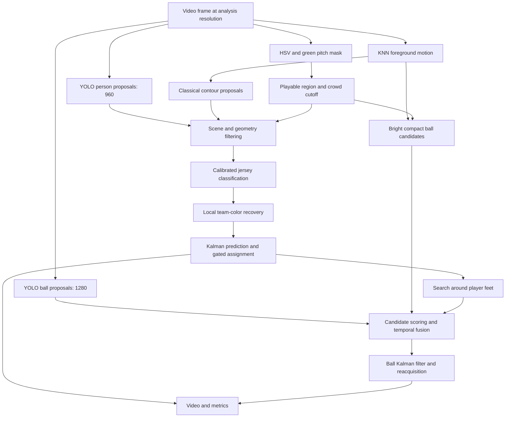

# Soccer Video Analysis

[](https://github.com/MasoudKarimi4/soccer-video-analysis/actions/workflows/ci.yml)

**Player detection, team classification, multi-object tracking, and ball fusion in broadcast soccer.**

A picture-processing project that combines interpretable OpenCV operations with selective YOLO11 detection. The classical branch uses field segmentation, motion contours, jersey masks, and temporal tracking. The recommended hybrid branch uses YOLO for object proposals, then applies scene filtering, color classification, local recovery, and a custom Kalman/assignment tracker.


*Decoded frames from fresh runs of this repository at 2.00, 5.30, and 8.00 seconds. See [visual evidence](docs/visual-evidence.md) for provenance, the supplied historical comparison, and limitations.*

## What it does

- Segments the green pitch with HSV thresholding, morphology, and connected components.
- Suppresses the stadium/crowd region using row-wise pitch occupancy.
- Detects players using motion contours or YOLO proposals with scene and geometry filtering.
- Classifies red/light jerseys using calibrated HSV masks; ambiguous objects remain `OTHER`.
- Maintains player identities with constant-velocity Kalman filters and gated assignment.
- Searches locally around tracks to recover short misses.
- Fuses learned and classical ball candidates, including searches near the previous ball and player feet.
- Writes annotated video, per-track statistics, frame-level measurements, and run metadata.


## Quick start

Use **Python 3.10–3.12**. Run commands from this repository's root. The original footage and model weights are excluded from Git; provide a local video and, for learned detection, local weights.

```bash
python -m venv .venv
```

Activate it with `.venv\Scripts\Activate.ps1` in PowerShell or `source .venv/bin/activate` on macOS/Linux.

### Classical pipeline: no model weights

```bash
python -m pip install -r requirements-core.txt
python run_experiment.py classical --video data/soccer_footage.mp4 --output outputs/classical
```

The default preset processes the first 10 seconds at width 960. Automatic calibration is used unless you supply a manual seed. Use `--duration-sec 0` to process to the end of the video. Longer footage can contain camera cuts and changing color conditions that this implementation does not explicitly handle.

### Recommended hybrid pipeline

```bash
python -m pip install -r requirements.txt
python run_experiment.py hybrid --video data/soccer_footage.mp4 --model models/yolo11s.pt --output outputs/hybrid
```

For the **original project footage only**, reproduce the manually calibrated configuration with:

```bash
python run_experiment.py hybrid --video data/soccer_footage.mp4 --model models/yolo11s.pt --seed-file configs/manual_seed.example.json --output outputs/hybrid_seeded
```

The preset uses separate player/ball inference at **960/1280**, confidence thresholds **0.15/0.05**, playable overlap **0.25**, and CPU execution. The source frame is already resized to width 960; the larger ball inference input upsamples that image rather than recovering original source detail. Pass `--device 0` for a compatible CUDA installation. For CPU-only PyTorch, see [reproduction](docs/reproduction.md).

Obtain `yolo11s.pt` through the official [Ultralytics YOLO11 workflow](https://docs.ultralytics.com/models/yolo11/); the [model instructions](models/README.md) show how. This project uses pretrained COCO classes `person` (0) and `sports ball` (32).

### Detector-only comparison

```bash
python run_experiment.py baseline --video data/soccer_footage.mp4 --model models/yolo11s.pt --output outputs/baseline
```

This uses Ultralytics/ByteTrack and does not assign team labels. It is a different tracking architecture from the custom classical/hybrid tracker.

## Results and their meaning

The supplied final hybrid summary reports **4,590 accumulated player detections**, **35 created track IDs**, and **221 filtered detector ball candidates** across **300 frames**. These counts describe pipeline output; they are **not precision, recall, mAP, unique-player counts, or ground-truth ball accuracy**.

| Supplied run with saved evidence | Frames | Player/person detections | Track IDs | Ball evidence |
|---|---:|---:|---:|---|
| Classical `safe_v8` | 300 | 1,802 | 51 | 270 frames with a rendered ball state |
| Direct YOLO11m baseline | 300 | 5,052 | 36 person IDs | 81 sports-ball detections; 15 ball IDs |
| Hybrid YOLO11m | 300 | 4,469 | 30 | 205 filtered detector candidates; 270 rendered states |
| Final hybrid YOLO11s, high-resolution ball pass | 300 | 4,590 | 35 | 221 filtered detector candidates; 270 rendered states |
| Hybrid YOLO11s, longer window | 900 | 10,170 | 96 | 776 filtered detector candidates; 870 rendered states |

The paper also reports stronger classical checkpoints and a YOLO11s baseline whose raw outputs were not included in the bundle. Those historical claims are recorded separately in [Results](docs/results.md). The enhanced implementation has fresh verification results under [results/verified](results/verified/README.md); its fixes can change IDs and aggregate counts, so these are kept separate from the original experiments.

**Fresh 10-second verification:** classical produced **2,249 detections and 45 track IDs**; hybrid reproduced **4,590 detections and 221 detector ball candidates**, with **32 track IDs**. Hybrid ball telemetry records **269 measured states and one predicted state**. These are output measurements, not accuracy scores.

`ball_visible_frames` includes short predicted states; the 30-frame warmup explains the 270/300 and 870/900 ceilings in these supplied runs. A rendered or measured ball state can still refer to the wrong white object. The new implementation reports measured and predicted visibility separately and records the state of every frame.

## Architecture



See [architecture](docs/architecture.md) and [theory](docs/theory.md) for the code mapping, equations, assumptions, and tradeoffs.

## Repository guide

| Path | Purpose |
|---|---|
| `soccer_opencv_pipeline.py` | Shared CV primitives, custom trackers, and classical command line |
| `soccer_hybrid_pipeline.py` | Learned proposals, filtering, ball fusion, and hybrid command line |
| `run_ultralytics_baseline.py` | Direct detector/ByteTrack comparison |
| `run_experiment.py`, `configs/` | Portable experiment presets and clip-specific example seed |
| `runtime_support.py` | Parameter validation, environment metadata, and asset fingerprints |
| `manual_seed_tool.py` | Interactive jersey/ball calibration |
| `generate_pipeline_figures.py` | Explain the hybrid stages through images |
| `generate_classical_figures.py` | Explain the classical stages through images |
| `capture_evidence.py`, `extract_debug_frames.py` | Capture actual input/output frames |
| `docs/` | Theory, reproduction, results, limitations, evidence, and adapted analysis paper |
| `results/historical/` | Selected supplied summaries and track CSVs, with provenance |
| `results/verified/` | Fresh measurements of this repository's implementation |
| `tests/`, `.github/workflows/` | Regression tests, synthetic video smoke test, and CI |

Outputs go to the directory supplied with `--output`. Use a new directory for each experiment; scripts replace same-named output files.

## Tests and contribution

```bash
python -m unittest discover -s tests -v
python validate_repository.py
```

Tests need only the core dependencies. CI runs them on Windows and Linux with Python 3.10 and 3.12, without requiring private footage or downloading detector weights. The synthetic test checks I/O and metric consistency, not soccer detection accuracy. See [CONTRIBUTING](CONTRIBUTING.md).

## Documentation and attribution

- [Reproduce experiments and calibrate another video](docs/reproduction.md)
- [Results, metric definitions, and conflicting historical claims](docs/results.md)
- [Visual evidence and capture commands](docs/visual-evidence.md)
- [Known limitations and next experiments](docs/limitations.md)
- [Analysis paper, adapted for GitHub](docs/paper/analysis-paper.md)
- [Sources and references](docs/references.md)
- [Repository preparation and publishing](docs/repository-preparation.md)
- [Licensing and third-party assets](docs/licensing.md)

