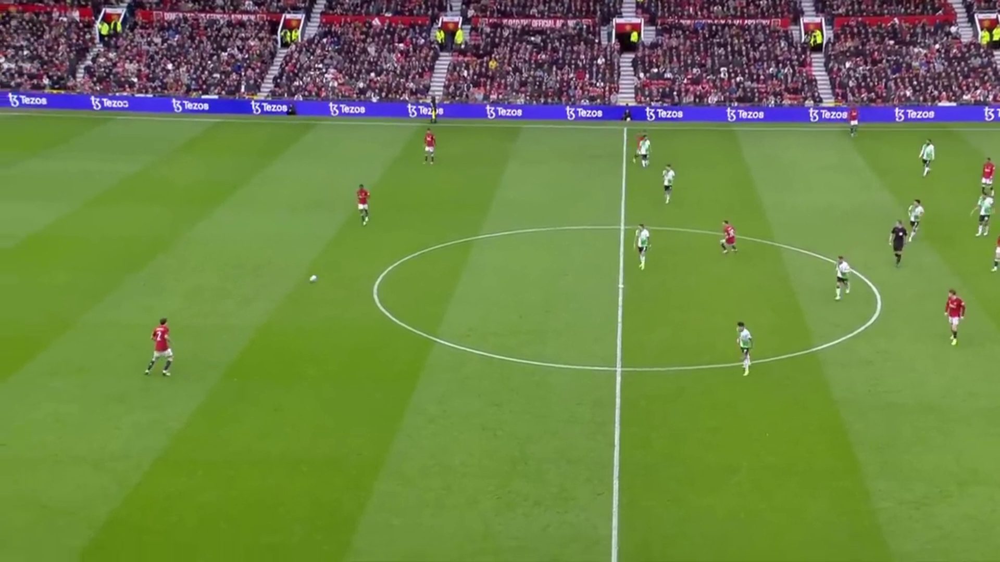
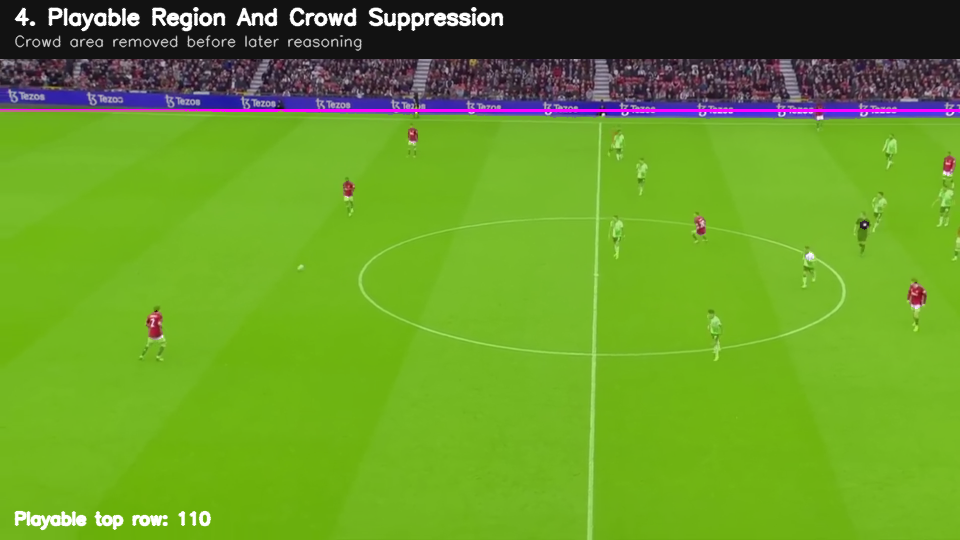
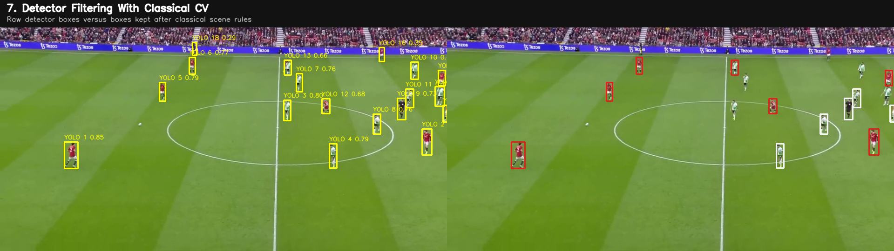
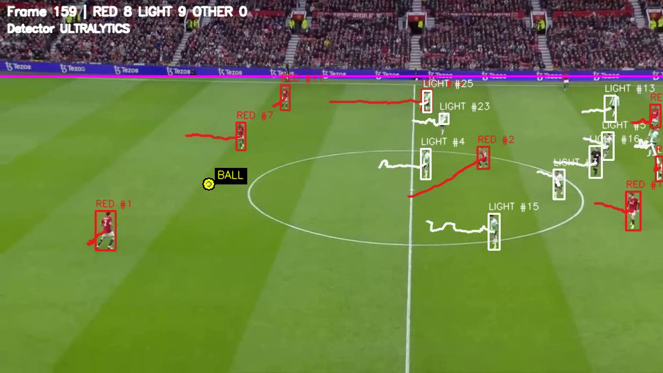

> Archived analysis paper (April 2026), adapted for GitHub: student IDs removed, figure paths repaired. The original paper is preserved in the source bundle. Historical claims and unavailable checkpoints are qualified in [Results](../results.md); this paper predates the repository fixes. Figure 5 links to a fresh extraction from the supplied final output.

---
title: "Soccer Player Detection and Multi-Object Tracking"
subtitle: "CSI4133 Picture Processing Project Report"
author:
  - "Group 5"
  - "Masoud Karimi"
  - "Zachary Sikka"
date: "April 2026"
---

# Abstract

This project implements a video analysis pipeline for detecting and tracking soccer players in broadcast footage. The original system was designed around traditional picture-processing methods, including HSV color conversion, green-field segmentation, background subtraction, contour extraction, geometric filtering, jersey-color classification, Kalman prediction, and Hungarian assignment. During development, the pipeline was extended into a hybrid system that uses a YOLO detector for player and ball proposals while preserving classical computer vision for scene filtering, team classification, local recovery, ball fusion, and temporal tracking. Experiments were performed on a 10-second, 300-frame soccer clip. The best classical pipeline produced 2195 player detections, 46 player tracks, and 270 ball-visible frames. The final hybrid system produced 4590 player detections, 35 tracks, 221 detector ball candidates, and 270 ball-visible frames. These results show that traditional image processing remains useful for interpretable sports-video analysis, while learned object detection can improve the weakest proposal-generation stages.

**Keywords:** soccer video analysis, picture processing, OpenCV, HSV segmentation, background subtraction, YOLO, Kalman filter, Hungarian assignment, multi-object tracking.

# I. Introduction

Sports video analysis is a practical computer vision problem because it combines object detection, object tracking, color analysis, motion analysis, and scene understanding. Soccer footage is especially challenging because the camera may pan or zoom, players are often small in the frame, the ball is fast and visually small, and the background includes spectators, advertising boards, field lines, shadows, and broadcast artifacts. The objective of this project was to build an end-to-end program that detects soccer players, assigns them to teams, tracks their movement over time, and highlights the ball in a broadcast video.

The project began as a traditional picture-processing pipeline. The main idea was to isolate the playing field, detect moving foreground objects, identify which moving blobs were likely players, classify each player using jersey color, and connect detections across frames using temporal tracking. This matched the original proposal, which emphasized OpenCV-based processing, field segmentation, contour extraction, and multi-object tracking.

As the system was tested, several limitations became visible. Motion-only player detection created fragmented tracks and could miss players who were nearly stationary. Light-colored jerseys were harder to classify because they could be confused with pitch markings, socks, highlights, and the white ball. The ball itself was difficult because it occupied only a few pixels and was visually similar to other white objects. To address these weaknesses, a final hybrid system was implemented. In this version, YOLO provides stronger learned proposals for players and the ball, while OpenCV-based logic still performs the scene modeling, team classification, filtering, recovery, tracking, and visualization.

The main contribution of the project is therefore not a pure deep-learning system. Instead, it is a layered computer vision pipeline where learned detection strengthens the proposal stage and traditional picture processing remains responsible for domain-specific reasoning.

# II. Tools and Data

The implementation was written in Python. The main libraries were OpenCV, NumPy, SciPy, Ultralytics, and LAP. OpenCV was used for video reading, frame conversion, thresholding, morphology, background subtraction, contour extraction, Kalman filtering, and annotation [1]-[7]. NumPy was used for image-array processing and metric calculations. SciPy provided the Hungarian assignment implementation through `linear_sum_assignment` when available [8]. Ultralytics was used to run local YOLO models such as `yolo11s.pt` [9]. MATLAB and its Image Processing and Computer Vision Toolboxes provide comparable reference workflows for color thresholding, foreground detection, Kalman tracking, and object detection, but this project implementation is primarily Python/OpenCV based [15]-[18].

The input data was broadcast soccer footage from YouTube. The reported experiments use a 10-second segment of `soccer_footage.mp4`, corresponding to 300 processed frames. The clip includes common real-world complications: camera motion, players at different scales, partial occlusion, crowd and stadium regions, shadows, white field lines, and a small fast-moving ball.

The main implementation files were:

- `soccer_opencv_pipeline.py`: classical OpenCV pipeline.
- `run_ultralytics_baseline.py`: detector-only baseline using Ultralytics.
- `soccer_hybrid_pipeline.py`: final hybrid pipeline.
- `manual_seed.json`: manual calibration file for team colors and ball position.

# III. Processing Pipeline

The final dataflow can be summarized as follows:

1. Read the video frame and resize it to a working analysis resolution.
2. Convert the frame from BGR to HSV.
3. Segment the green pitch and suppress the top crowd/stadium region.
4. Estimate foreground motion using background subtraction.
5. Generate player proposals using either motion contours or YOLO person detections.
6. Filter player boxes using geometry, playable-region overlap, and green-pixel rejection.
7. Classify each player as red, light, or other using jersey-color masks.
8. Recover short missed detections near active tracks using local color search.
9. Track players using Kalman prediction and Hungarian assignment.
10. Detect the ball using detector proposals, classical white-object search, local search, and temporal fusion.
11. Save annotated video, track metrics, and run summaries.

**Fig. 1.** Example input frame from the processed soccer clip.

# IV. Field Segmentation and Crowd Suppression

The first major stage isolates the soccer field from the rest of the broadcast frame. The frame is converted from BGR to HSV because HSV separates hue, saturation, and brightness more cleanly than RGB for color-thresholding tasks [2]. The pitch is detected by thresholding pixels in the green range using the same principle as OpenCV's `inRange` workflow [3]. The result is a binary image in which likely grass pixels are assigned to the foreground and all other pixels are rejected.

The raw binary mask is cleaned with morphological operations [4]. Opening removes isolated noise, while closing fills small holes inside the field region. Connected-component reasoning is then used to preserve the dominant green region. This prevents small green objects in the crowd or advertising area from being treated as part of the field.

After the field mask is built, the pipeline estimates a playable-region cutoff. The top section of many broadcast frames contains spectators, benches, advertisements, or stadium structure. Even if object detectors find human-like shapes in that region, they are not relevant to player tracking. The playable mask therefore acts as a scene prior: detections are only trusted if they overlap the pitch or plausible playable area.

**Fig. 2.** Field segmentation constrains later detection to the actual playable region.

# V. Motion Detection

Motion detection was used heavily in the classical pipeline and remains a supporting cue in the hybrid pipeline. Each frame is first smoothed with a Gaussian blur to reduce grass texture and small intensity changes that can create false foreground pixels. A KNN background subtractor then estimates which pixels are moving relative to the learned background model [6], [14].

The foreground mask is post-processed with thresholding and morphology. This creates connected motion blobs that can be used for contour extraction. The motion mask is combined with the playable-region mask using logical operations. This guarantees that motion in the crowd or stadium area is not treated as a player candidate.

In the early classical system, motion blobs were the main source of player detections. This was explainable and directly related to picture-processing concepts, but it was sensitive to camera motion, overlapping players, and players who moved slowly. In the final hybrid system, motion is no longer the main detector. It is used as an auxiliary cue for ball search, recovery, and visual explanation.

# VI. Player Detection

The classical player detector starts from contours in the foreground motion mask [5]. A contour is a boundary around a connected moving region. For each contour, the program builds a bounding box and filters it using simple geometric constraints. Boxes are rejected if they are too small, too large, too wide, or mostly green. The shape tests reflect the expectation that a soccer player should usually appear taller than wide and should contain non-field pixels.

The hybrid pipeline replaces the weakest part of this stage. Instead of relying only on motion contours, the system uses YOLO person detections as player proposals [9], [10]. In the final configuration, `yolo11s.pt` is loaded through Ultralytics, player inference uses an input size of 960, and the detector score threshold is relaxed to retain difficult small players. The detector produces raw bounding boxes and confidence values, but these boxes are not accepted blindly.

Classical filtering is applied after YOLO. The pipeline checks playable-region overlap, adaptive size constraints, aspect ratio, and non-green pixel content. This keeps the learned detector tied to the soccer scene. A detector may find spectators, staff, or other irrelevant people, but the field mask and geometry filters remove many of these false positives.

**Fig. 3.** Learned proposals are filtered using classical scene and geometry constraints.

# VII. Team Classification

Each accepted player detection is assigned to one of three labels: `team_red`, `team_light`, or `team_other`. The classifier uses HSV color analysis rather than a learned team classifier. For each player bounding box, the top 60 percent of the crop is selected because it is more likely to contain the jersey and less likely to contain grass, legs, socks, or field markings.

The program then computes red and light-color masks inside the player region. A player is labeled red when the red pixel ratio is sufficiently high. A player is labeled light when the white or light-jersey ratio is sufficiently high. Otherwise, the player is labeled other. This approach is interpretable because the decision is based on explicit pixel ratios and thresholds.

The light team was more difficult to classify than the red team. Light jerseys can overlap in color with the ball, field lines, socks, player highlights, and bright patches in the broadcast image. To improve robustness, the pipeline includes calibration. Calibration can be automatic, using early frames of the clip, or manual, using boxes from `manual_seed.json`. The learned color profile estimates threshold values for red hue ranges, red saturation and value, white saturation, and white value. These values are blended with default guard rails to avoid overfitting.

**Fig. 4.** HSV masks are used to classify players into red and light teams.

# VIII. Temporal Tracking

The tracker follows a tracking-by-detection design similar in spirit to SORT-style systems [11]. Each frame produces a set of detections, and the tracker connects those detections to existing identities. The state of each tracked player is represented by a Kalman filter [7], [12]. The filter estimates position and velocity, predicts where the player should appear in the next frame, and corrects the prediction when a new detection is assigned.

For association, the program builds a cost matrix between predicted track positions and detected player centroids. Lower costs correspond to shorter physical distances between a prediction and a measurement. The Hungarian algorithm is used to find the minimum-cost matching between tracks and detections [8], [13]. Team-label mismatch penalties discourage a red player track from being assigned to a light player detection and vice versa.

Tracks are allowed to persist briefly when a detection is missing. This is necessary because players can overlap, pass behind other players, or temporarily fail detector thresholds. However, if a track is missing for too long, it is removed. This prevents old identities from remaining active after the player has left the scene or after the tracker has lost reliable evidence.

The final hybrid system also includes local recovery. If an active track is not matched in the current frame, the pipeline searches near the predicted location using team-color masks. This helps recover players that the detector misses for a few frames and reduces identity fragmentation.

# IX. Ball Detection and Fusion

The ball is the hardest object in the system. It is small, often blurred, and visually similar to the light team, field lines, and socks. A single detection method was not reliable enough, so the final pipeline uses fused ball evidence.

The first source is YOLO sports-ball detection [9], [10]. In the final system, the ball detector uses a larger input size of 1280, while player detection uses 960. The reason is that the ball occupies very few pixels, so increasing detector input size gives the model more spatial evidence. This high-resolution pass increased detector ball candidates from 151 in the earlier hybrid-ball run to 221 in the final high-resolution run.

The second source is classical ball search. The program searches for small bright candidates using whiteness, circularity, density, motion, and isolation from larger white structures. It also searches locally around the previous ball estimate and around player foot regions. These rules encode soccer-specific context: the ball is often near players, but it should not be inside a player's torso.

Candidate fusion combines detector proposals and classical proposals. The final ball decision considers candidate score, temporal proximity, physical plausibility, and whether a strong new candidate should reinitialize the ball state. The ball is tracked with a Kalman filter and drawn with a high-contrast marker so that the output video is easier to inspect.

**Fig. 5.** Final hybrid output after player tracking, team classification, and ball fusion.

# X. Experimental Validation

The system was evaluated on a 10-second, 300-frame clip. Validation used both quantitative summaries and qualitative visual inspection. Quantitative metrics were taken from the saved `run_summary.json` files. The main metrics were total player detections, team split, number of player tracks, detector ball candidates, and ball-visible frames. Qualitative inspection was also important because some metrics are too coarse to capture whether the correct ball was selected in a difficult frame.

The main experimental checkpoints were:

- **Classical calibrated OpenCV:** 2195 player detections, 1026 red detections, 1149 light detections, 20 other detections, 46 tracks, and 270 ball-visible frames.
- **Direct YOLO baseline:** 5397 person detections, 39 person tracks, 58 sports-ball detections, and 15 ball tracks. This baseline was useful for detector comparison but did not model team identity.
- **Hybrid YOLO plus ball fusion:** 4590 player detections, 2334 red detections, 2229 light detections, 27 other detections, 35 tracks, 151 detector ball candidates, and 270 ball-visible frames.
- **Final high-resolution hybrid:** 4590 player detections, 2334 red detections, 2229 light detections, 27 other detections, 35 tracks, 221 detector ball candidates, and 270 ball-visible frames.

The classical system produced a strong baseline after several iterations. The best automatic classical checkpoint, `outputs_v5_calibrated_soft`, generated 2195 player detections and maintained ball visibility for 270 of the 300 frames. This showed that segmentation, color classification, and tracking could produce useful results without deep learning.

The direct YOLO baseline produced many person detections, but it did not model team identity and did not use the explicit field, jersey, or ball-fusion logic. It was useful as a comparison because it showed the strength of a learned detector, but it did not address the full project goal by itself.

The hybrid system produced the best overall result. It used YOLO where classical motion detection was weakest, then used picture-processing logic to classify, filter, recover, and track objects. The final high-resolution ball pass did not change the coarse `ball_visible_frames` count because the earlier hybrid already reached 270 visible frames. However, it produced more detector ball candidates and corrected known qualitative ball-localization failures, including the difficult frame-159 example used during presentation preparation.

# XI. Discussion

The main result is that classical picture processing and learned detection solve different parts of the problem. HSV thresholding, morphology, connected components, contour analysis, and geometric filtering give an interpretable scene model. They make it clear why certain pixels, boxes, or tracks are accepted. This is valuable in an academic project because the pipeline can be explained stage by stage.

At the same time, the pure classical system struggled with the hardest visual cases. Motion detection depends on foreground differences, so it can miss players who are nearly stationary or whose motion is hidden by camera movement. It can also create false detections from non-player motion. A learned detector is better at recognizing players based on appearance, especially when players are small or distant.

The hybrid approach was therefore the most effective design. YOLO generated stronger candidate boxes, while OpenCV-based processing still handled field segmentation, crowd suppression, team classification, local recovery, ball scoring, and tracking. This split made the system both more accurate and more explainable than either method alone.

Several limitations remain. First, the evaluation did not use manually labeled ground truth boxes, so the metrics measure pipeline outputs rather than true precision and recall. Second, the system was tuned for one broadcast clip, so color thresholds and detector parameters may need adjustment for other stadiums, camera angles, jerseys, or lighting conditions. Third, the ball metric is too coarse. The same number of visible-ball frames can hide important differences in whether the selected ball location is correct. Finally, the high-resolution detector pass improves small-ball evidence but increases CPU runtime.

# XII. Conclusion

This project produced an end-to-end soccer video analysis system that detects players, classifies teams, tracks player movement, and identifies the ball. The work began with a classical OpenCV pipeline based on field segmentation, background subtraction, contours, HSV jersey masks, Kalman filtering, and Hungarian assignment. That pipeline demonstrated the value of traditional picture-processing methods and produced a useful baseline.

The final version extended the baseline into a hybrid system. YOLO was used for player and ball proposals, but traditional computer vision remained central to the design. The final system processed 300 frames, produced 4590 player detections, balanced the red and light team counts, maintained 35 player tracks, and increased detector ball candidates to 221 while preserving 270 ball-visible frames. Overall, the project shows that image processing remains effective for sports-video analysis, especially when combined with modern learned detection in a controlled and interpretable way.

# References

[1] G. Bradski, "The OpenCV Library," Dr. Dobb's Journal of Software Tools, 2000.

[2] OpenCV, "Color Space Conversions," OpenCV 4.x Documentation. [Online]. Available: https://docs.opencv.org/4.x/d8/d01/group__imgproc__color__conversions.html. Accessed: Apr. 14, 2026.

[3] OpenCV, "Thresholding Operations using inRange," OpenCV 4.x Tutorials. [Online]. Available: https://docs.opencv.org/4.x/da/d97/tutorial_threshold_inRange.html. Accessed: Apr. 14, 2026.

[4] OpenCV, "Morphological Transformations," OpenCV-Python Tutorials. [Online]. Available: https://docs.opencv.org/4.x/d9/d61/tutorial_py_morphological_ops.html. Accessed: Apr. 14, 2026.

[5] OpenCV, "Contours: Getting Started," OpenCV-Python Tutorials. [Online]. Available: https://docs.opencv.org/4.x/d4/d73/tutorial_py_contours_begin.html. Accessed: Apr. 14, 2026.

[6] OpenCV, "How to Use Background Subtraction Methods," OpenCV 4.x Tutorials. [Online]. Available: https://docs.opencv.org/4.x/d1/dc5/tutorial_background_subtraction.html. Accessed: Apr. 14, 2026.

[7] OpenCV, "cv::KalmanFilter Class Reference," OpenCV 4.x Documentation. [Online]. Available: https://docs.opencv.org/4.x/dd/d6a/classcv_1_1KalmanFilter.html. Accessed: Apr. 14, 2026.

[8] SciPy Developers, "scipy.optimize.linear_sum_assignment," SciPy Reference Manual. [Online]. Available: https://docs.scipy.org/doc/scipy/reference/generated/scipy.optimize.linear_sum_assignment.html. Accessed: Apr. 14, 2026.

[9] Ultralytics, "Ultralytics YOLO Documentation," Ultralytics Docs. [Online]. Available: https://docs.ultralytics.com/. Accessed: Apr. 14, 2026.

[10] J. Redmon, S. Divvala, R. Girshick, and A. Farhadi, "You Only Look Once: Unified, Real-Time Object Detection," in Proc. IEEE Conf. Comput. Vis. Pattern Recognit. (CVPR), Las Vegas, NV, USA, 2016, pp. 779-788, doi: 10.1109/CVPR.2016.91.

[11] A. Bewley, Z. Ge, L. Ott, F. Ramos, and B. Upcroft, "Simple Online and Realtime Tracking," in Proc. IEEE Int. Conf. Image Process. (ICIP), Phoenix, AZ, USA, 2016, pp. 3464-3468, doi: 10.1109/ICIP.2016.7533003.

[12] R. E. Kalman, "A New Approach to Linear Filtering and Prediction Problems," Journal of Basic Engineering, vol. 82, no. 1, pp. 35-45, Mar. 1960, doi: 10.1115/1.3662552.

[13] H. W. Kuhn, "The Hungarian Method for the Assignment Problem," Naval Research Logistics Quarterly, vol. 2, no. 1-2, pp. 83-97, 1955, doi: 10.1002/nav.3800020109.

[14] Z. Zivkovic and F. van der Heijden, "Efficient Adaptive Density Estimation per Image Pixel for the Task of Background Subtraction," Pattern Recognition Letters, vol. 27, no. 7, pp. 773-780, May 2006, doi: 10.1016/j.patrec.2005.11.005.

[15] MathWorks, "Color Thresholder," Image Processing Toolbox Documentation. [Online]. Available: https://www.mathworks.com/help/images/ref/colorthresholder-app.html. Accessed: Apr. 14, 2026.

[16] MathWorks, "vision.ForegroundDetector," Computer Vision Toolbox Documentation. [Online]. Available: https://www.mathworks.com/help/vision/ref/vision.foregrounddetector-system-object.html. Accessed: Apr. 14, 2026.

[17] MathWorks, "Use Kalman Filter for Object Tracking," Computer Vision Toolbox Example. [Online]. Available: https://www.mathworks.com/help/vision/ug/using-kalman-filter-for-object-tracking.html. Accessed: Apr. 14, 2026.

[18] MathWorks, "Object Detection," Computer Vision Toolbox Documentation. [Online]. Available: https://www.mathworks.com/help/vision/object-detection.html. Accessed: Apr. 14, 2026.
