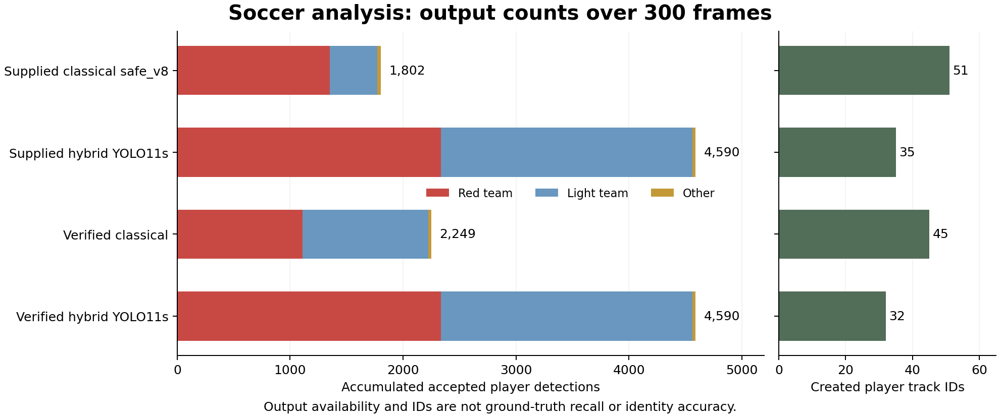

# Results and evaluation

The project uses output summaries and frame inspection rather than labeled ground-truth evaluation. This document separates saved historical experiments, claims supported only by the paper/development notes, and fresh verification of the enhanced implementation.

## Fresh repository verification

The first 10 seconds of the original video contain 300 frames at 30 FPS. The enhanced implementation used the provided frame-111 manual seed, analysis width 960 and RNG seed 0.

| System | Frames | Player detections | Red / light / other | Created player track IDs | Ball candidates | Measured / predicted-visible states |
|---|---:|---:|---|---:|---:|---|
| Classical | 300 | 2,249 | 1,108 / 1,116 / 25 | 45 | Not a learned stream | 270 / 0 |
| Hybrid YOLO11s, 960/1280 | 300 | 4,590 | 2,334 / 2,229 / 27 | 32 | 221 | 269 / 1 |

The full records are in [verified results](../results/verified/README.md). A 60-frame direct YOLO11s smoke run also completed, with 1,114 person detections and 21 person IDs; it is not included as a same-window numerical comparison.

The supplied classical `safe_v8` row is an imbalanced experimental checkpoint. It is not the reported best classical result. Bar height and fewer IDs must not be interpreted as recall or tracking accuracy.

## Supplied historical runs with raw summaries

| Run | Frames | Player/person detections | Team red / light / other | Player/person IDs | Ball evidence |
|---|---:|---:|---|---:|---|
| Classical safe_v6 | 300 | 2,289 | 1,885 / 372 / 32 | 61 | 270 rendered states |
| Classical safe_v7 | 300 | 2,266 | 1,884 / 350 / 32 | 61 | 270 rendered states |
| Classical safe_v8 | 300 | 1,802 | 1,352 / 418 / 32 | 51 | 270 rendered states |
| Direct YOLO11m baseline | 300 | 5,052 | No team labels | 36 | 81 sports-ball detections; 15 ball IDs |
| Hybrid YOLO11m | 300 | 4,469 | 2,293 / 2,148 / 28 | 30 | 205 filtered detector candidates; 270 rendered states |
| Final hybrid YOLO11s high-resolution | 300 | 4,590 | 2,334 / 2,229 / 27 | 35 | 221 filtered detector candidates; 270 rendered states |
| Hybrid YOLO11s, 30-second window | 900 | 10,170 | 5,438 / 4,597 / 135 | 96 | 776 filtered detector candidates; 870 rendered states |

The selected summaries and track CSVs are checked in under [results/historical](../results/historical/provenance.json). Path strings were reduced to basenames; all numerical values are preserved. Hashes identify the original summary bytes. Duplicate high-resolution runs with identical numbers were omitted. Complete run parameters and original dependency versions were not recorded for these historical summaries.

The laptop's safe_v6–safe_v8 runs skew strongly red. Their higher total counts do not make them stronger player detectors. The retained current source reproduces a more balanced fresh classical result; the experimental variants that produced all safe-run outputs were not supplied as separate source versions.

The supplied YOLO11m hybrid creates fewer IDs than the YOLO11s hybrid, but that is insufficient to rank them. The original notes recommend YOLO11s for overall qualitative behavior. No controlled m/s/n model accuracy benchmark or timing study was supplied.

## Historical claims without corresponding raw outputs

| Checkpoint described in paper/notes | Player/person detections | Player/person IDs | Ball evidence | Support |
|---|---:|---:|---|---|
| Automatic classical `v5_calibrated_soft` | 2,195 | 46 | 270 rendered states | Paper and progress report; raw folder absent |
| Restored seeded classical `v7_refined_seeded_restored` | 2,247 | 47 | 270 rendered states | Development context/presentation brief; raw folder absent |
| Direct YOLO11s baseline | 5,397 | 39 | 58 sports-ball detections; 15 ball IDs | Paper/architecture comparison; raw folder absent |
| Earlier YOLO11s fused-ball hybrid | 4,590 | 35 | 151 filtered detector candidates; 270 rendered states | Paper/notes; raw folder absent |

These were reportedly 300-frame experiments. The paper calls the automatic classical result the best classical baseline, while later development notes call the restored manually seeded result the best classical checkpoint. Both are preserved with their calibration distinction and provenance. Neither is presented as an independently verified saved run in this bundle.

The paper describes a ball-candidate increase from 151 to 221 after the higher-resolution pass. Only the final 221-candidate raw summary is present here. The change is a historical report claim; an independently reproduced 960-versus-1280 ablation was not performed during preparation.

## Metric definitions

| Field | What it measures | What it does not measure |
|---|---|---|
| `player_detections_total` | Accepted observations accumulated over frames, including local recovery | Unique players, precision or recall |
| `player_detections_by_team` | Current per-detection color classifications | Ground-truth club identity or team accuracy |
| `tracks_total` | All created player IDs, active plus retired | True player count or identity switches |
| `raw_detector_candidates_total` | Raw person proposals before CV filtering | Accepted detections or false positives |
| `detector_ball_candidates_total` | Learned ball proposals remaining after contextual/visual filtering | Raw model output count or correct-ball recall |
| `ball_visible_frames` | Frames where a ball state is rendered (`missed <= 6`) | Correct localization or actual physical visibility |
| `ball_measured_frames` | Rendered states updated with an accepted candidate | Ground-truth verified ball positions |
| `ball_predicted_visible_frames` | Rendered states with no accepted current candidate | Additional detector successes |
| `points` in new track CSV | Total confirmed player observations during track lifetime | Ground-truth trajectory length |
| `trail_points` | Number of currently retained visual trail points | Full lifetime observations |
| Image-plane speeds | Displacement of measured filtered positions in px/s | Physical player speed |

Historical CSV `points` is the final deque length, capped by the trail limit (usually 60), rather than total observations. Do not mix that column with the enhanced schema. The new CSV retains both total `points` and bounded `trail_points`.

The 30-frame ball warmup means supplied 270/300 availability corresponds to a ceiling on eligible frames, not 90% ball-detection accuracy. Predicted states also count toward visibility. The same logic applies to the 870/900 longer run.

## Interpretation

The hybrid is the recommended engineering configuration because it supplies appearance-based proposals while retaining explicit pitch, jersey, recovery and tracking reasoning. Fresh execution confirms that it runs and reproduces the original accumulated proposal counts. The snapshots show more complete scene coverage in the selected examples, while also revealing clutter, stale boxes and imperfect trajectories.

Evidence does not support claims of quantified accuracy superiority or broad generalization. The [limitations](limitations.md) describe an appropriate labeled evaluation and controlled ablation plan. [Visual evidence](visual-evidence.md) documents exactly which frames and runs are shown.
