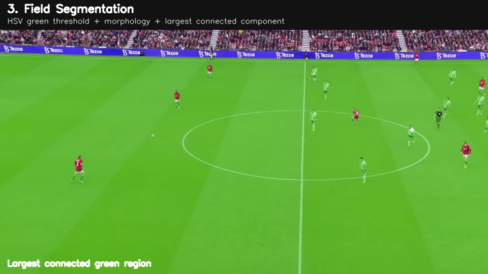
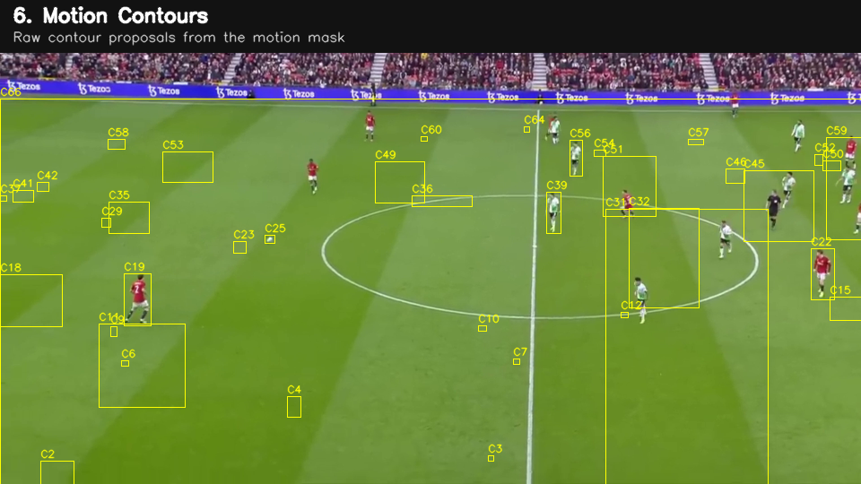
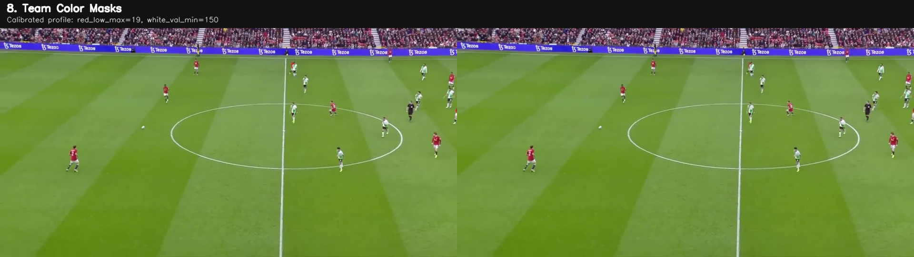

# Image processing and tracking theory

The formulas below explain the implemented decisions. They do not establish ground-truth detection accuracy. The project paper provides historical context; implementation details here follow the retained code.

## Color segmentation

OpenCV's 8-bit HSV uses hue in **0–179** and saturation/value in **0–255**. HSV separates chromatic hue from brightness, making green grass and red/white kits easier to threshold than raw BGR. It does not make color invariant to shadows or broadcast changes. See [OpenCV inRange](https://docs.opencv.org/4.x/da/d97/tutorial_threshold_inRange.html).

For pixel $p$, the field mask is

$$M_g(p)=\mathbf{1}\{28\leq H(p)\leq95,\;25\leq S(p)\leq255,\;25\leq V(p)\leq255\}.$$

The mask is opened once and closed twice with a 5×5 elliptical element, then restricted to its largest connected component. Opening is erosion followed by dilation and removes small components. Closing is dilation followed by erosion and fills small gaps. These operations also alter thin structures and can remove small player/ball evidence; segmentation remains approximate. See [OpenCV morphology](https://docs.opencv.org/4.x/d9/d61/tutorial_py_morphological_ops.html).

The crowd boundary is estimated from the fraction of green pixels in each row. The default searches for eight consecutive rows with occupancy at least 0.30. A fallback boundary at 18% of image height is used if no qualifying region is found. A manual top cutoff can raise it. The playable mask is the processed pitch mask with rows above this boundary removed; it is not a calibrated pitch polygon.

## Motion and contour proposals

KNN background subtraction estimates foreground from a rolling image model after a 5×5 Gaussian blur. Binary thresholding at 200, opening/closing with a 3×3 element, dilation, and the playable mask produce the final motion mask. See [OpenCV background subtraction](https://docs.opencv.org/4.x/d1/dc5/tutorial_background_subtraction.html).

Classical player proposals come from connected motion contours. Area, height/width ratio and non-green occupancy reject implausible boxes; perspective heuristics relax criteria for distant players. These assumptions explain both the algorithm's interpretability and its weaknesses: camera panning produces apparent foreground motion, touching players merge, and nearly stationary players may disappear.

## Jersey classification and calibration

For an upper-body region $\Omega$, green pixels are excluded and red/light ratios are calculated:

$$r=\frac{\sum_{p\in\Omega}M_r(p)M_{\neg g}(p)}{\sum_{p\in\Omega}M_{\neg g}(p)},\qquad
w=\frac{\sum_{p\in\Omega}M_w(p)M_{\neg g}(p)}{\sum_{p\in\Omega}M_{\neg g}(p)}.$$

Red spans both ends of the hue circle, so its mask joins a low-hue and a high-hue interval. White/light uses low saturation and sufficiently high value. Decisions combine pixel ratios, mean saturation/value and tiny-region rules; `OTHER` is retained when these heuristics do not support a team.

Calibration estimates threshold percentiles from auto-selected or manually boxed jersey pixels. It blends fitted values with generic defaults using parameter-specific weights and clips values with guard rails. This reduces sensitivity to a few unusually bright seed samples, but does not guarantee transfer to new jerseys or lighting.

The teams are color groups, not recognized clubs. Red/light counts need not be equal because occlusion and framing vary. Equal counts are also not proof of correct classification.

## Constant-velocity Kalman state

Each player and ball uses state $x_t=[u_t,v_t,\dot u_t,\dot v_t]^T$, with image coordinates and velocity measured per frame. The transition is

$$F=\begin{bmatrix}1&0&1&0\\0&1&0&1\\0&0&1&0\\0&0&0&1\end{bmatrix},\qquad
H=\begin{bmatrix}1&0&0&0\\0&1&0&0\end{bmatrix}.$$

The filter predicts $\hat x^-_t=F\hat x_{t-1}$ and $P^-_t=FP_{t-1}F^T+Q$. On measurement $z_t$, it uses

$$K_t=P^-_tH^T(HP^-_tH^T+R)^{-1},\quad
\hat x_t=\hat x^-_t+K_t(z_t-H\hat x^-_t),\quad
P_t=(I-K_tH)P^-_t.$$

The code uses OpenCV's [KalmanFilter](https://docs.opencv.org/4.x/dd/d6a/classcv_1_1KalmanFilter.html). Its process and measurement covariance values are engineering choices; they are not fitted from labeled uncertainty. A constant-velocity prior can bridge short misses but cannot reliably follow sudden kicks, camera cuts or prolonged occlusion.

## Data association

For predicted track $i$ and detection $j$,

$$C_{ij}=\|\hat p_i-p_j\|_2+\lambda_{ij},$$

where the team mismatch penalty discourages red-to-light assignments. SciPy's [linear_sum_assignment](https://docs.scipy.org/doc/scipy/reference/generated/scipy.optimize.linear_sum_assignment.html) solves the minimum-cost assignment. SciPy implements a modified Jonker–Volgenant algorithm; “Hungarian” is used in the original project as shorthand for optimal linear assignment. The optional greedy fallback is not equivalent.

The repository gates forbidden edges **before** optimization with a sufficiently large penalty and drops forbidden matches afterward. Otherwise an out-of-range match can steal a feasible detection from another track. Unmatched tracks persist up to the configured missed-frame threshold; unmatched detections create IDs. There is no appearance embedding or re-identification stage.

The design resembles [SORT's tracking-by-detection principle](https://arxiv.org/abs/1602.00763), but this implementation uses centroids/team penalties and local color recovery rather than reproducing SORT's box state and IoU association.

## Ball fusion and small-object inference

The ball's white appearance overlaps with pitch markings, socks and light jerseys. The system combines learned boxes with classical compact-object, local-neighborhood and foot-zone searches. Circularity $4\pi A/P^2$, density, brightness, whiteness, isolation and contextual exclusions contribute to handcrafted candidate ranking.

The high-resolution ball pass uses 1280 rather than 960 input size. This gives the network a larger representation of a small object, but the source frame was already resized to analysis width 960. Upsampling supplies no new original detail. The extra inference pass also adds runtime. [YOLO11 documentation](https://docs.ultralytics.com/models/yolo11/) is the appropriate model reference; the 2016 YOLO paper cited by the report explains the broader detector family rather than YOLO11's exact architecture.

The ball tracker may reacquire a strong candidate far from its prediction. That can correct a stale hypothesis, but it can also jump to a wrong bright object. Its scores are ranking heuristics, not probabilities. A measured update demonstrates candidate acceptance, not correctness.

## Image-plane motion

Matched player observations produce speed summaries in pixels/second:

$$s_t=\|p_t-p_{t_0}\|_2\frac{f_{\mathrm{fps}}}{t-t_0}.$$

The repository stores the previous measured position separately from predicted state when calculating this value. Camera motion, perspective and resizing affect it. It is not player speed in metres/second; obtaining that requires camera compensation and pitch calibration, which are outside this implementation.
