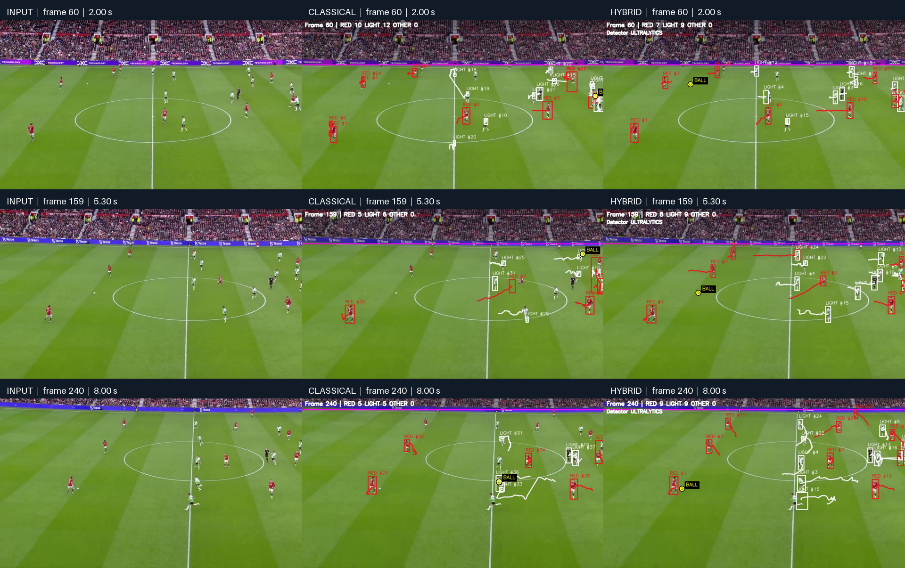
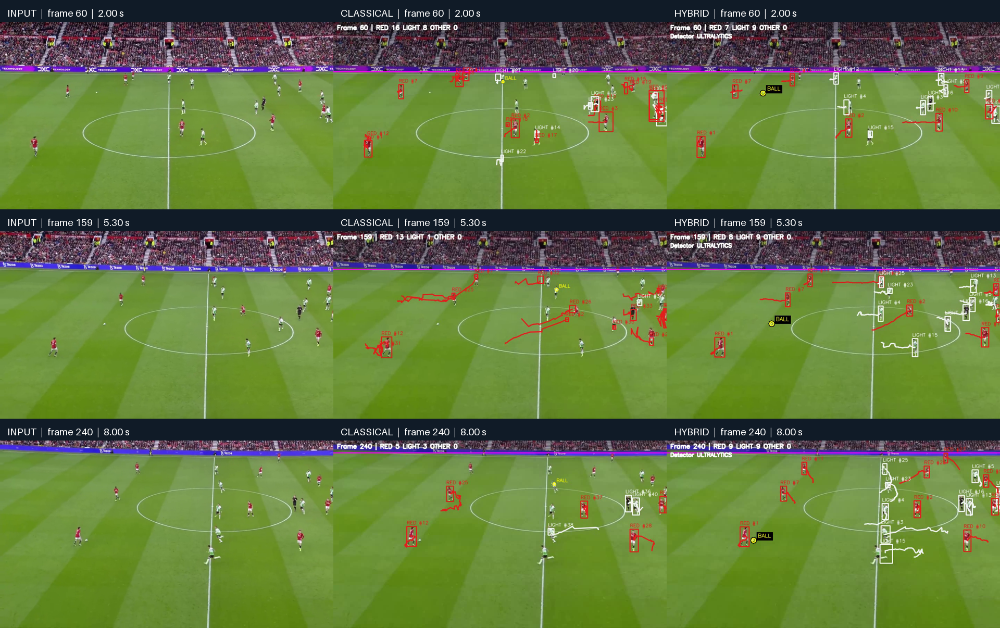

# Visual evidence and provenance

All detection/tracking screenshots are derived from actual supplied or freshly generated videos. No synthetic detector screenshots or invented ground-truth labels are included. The contact sheets add labels and resize panels for comparison; the individual decoded PNGs remain unmodified.

## Fresh enhanced implementation

Rows are source frames **60, 159 and 240**, corresponding to **2.00, 5.30 and 8.00 seconds**. Columns are original input, the fresh seeded classical run, and the fresh seeded YOLO11s hybrid run. All source videos start at frame zero at 30 FPS, so the frames align.

The [capture manifest](images/verified/capture_manifest.json) records each source filename, source frame count/FPS, output index, absolute source index and PNG SHA-256. Numeric result summaries are under [verified results](../results/verified/README.md). Individual frames include [input 159](images/verified/input_frame159.png), [classical 159](images/verified/classical_frame159.png) and [hybrid 159](images/verified/hybrid_frame159.png).

At frame 159, the hybrid places the ball marker near the small white object on the left of the center circle. This is qualitative alignment, not a measured localization error. The other frames expose imperfect trails, active boxes that can persist during misses, and difficult white-object hypotheses. They are included to make the behavior inspectable rather than imply every object is correct.

## Saved development outputs

The historical classical column is **`outputs_v7_refined_seeded_safe_v8`**, whose saved summary is notably red-heavy. The historical hybrid column is **`outputs_hybrid_ultralytics_yolo11s_ball_highresml_viz`**. The [historical capture manifest](images/capture_manifest.json) identifies the original output videos and decoded frames.

Using these images beside the fresh results avoids silently replacing historical outputs with newer runs. The development hybrid frame-159 screenshot is retained as historical evidence.

## Imported intermediate-stage illustrations

These illustrate the processing stages from earlier development runs. They are generated stage illustrations, not independent accuracy measurements. The [import manifest](images/imported_manifest.json) preserves source relative paths and image hashes.

| Figure | Content | Provenance |
|---|---|---|
| [HSV channels](images/hsv_channels.png) | Hue/saturation/value interpretation | Development hybrid figure pack, frame 159 |
| [Pitch segmentation](images/pitch_segmentation.png) | Raw/clean pitch reasoning | Development hybrid figure pack, frame 159 |
| [Playable region](images/playable_region.png) | Crowd cutoff and scene prior | Development hybrid figure pack, frame 159 |
| [Motion mask](images/motion_mask.png) | KNN foreground support | Development hybrid figure pack, frame 159 |
| [Classical contours](images/classical_contours.png) | Motion contour proposals | Development classical figure pack, frame 159 |
| [Detector filtering](images/detector_filtering.png) | Raw and filtered learned proposals | Development hybrid figure pack, frame 159 |
| [Team masks](images/team_masks.png) | Calibrated jersey masks | Development hybrid figure pack, frame 159 |
| [Local recovery](images/local_recovery.png) | Recovery around prior tracks | Development hybrid pack, example frame 31 |
| [Ball candidates](images/ball_candidates.png) | Filtered learned ball evidence | Development hybrid figure pack, frame 159 |
| [Manual calibration](images/manual_calibration.png) | Seed boxes | Source frame 111 |

The hybrid and classical stage generators were also executed on this repository's implementation as validation. Their generated artifacts remain in local ignored output folders; imported stage illustrations are labeled as such to avoid claiming they depict every code change.

## Recreate evidence

Use [capture_evidence.py](../scripts/capture_evidence.py) to extract aligned source/output frames. It fails if a requested frame cannot be read or saved. For nonzero-start output segments, specify `--annotated-start-frame` to align source indices. Stage generators replay frames and produce masks/candidate illustrations. Exact commands are in [reproduction](reproduction.md).

The comparison chart is derived solely from checked-in summaries using [summarize_results.py](../scripts/summarize_results.py), with values also in [comparison.csv](../results/comparison.csv). It visualizes output counts and created IDs; it is not an accuracy chart.

The original broadcast URL was not supplied. Frame excerpts therefore have local-video provenance rather than a verified external source link.
